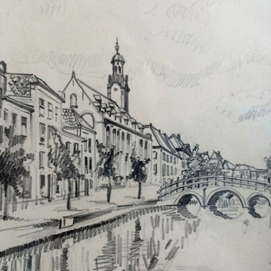

```{r setup, include=FALSE}
knitr::opts_chunk$set(echo = FALSE)
```

```{r, echo=FALSE, fig.align='center', out.width='100%'}

```

This website has been relocated to [https://e-m-mccormick.github.io/](https://e-m-mccormick.github.io/)